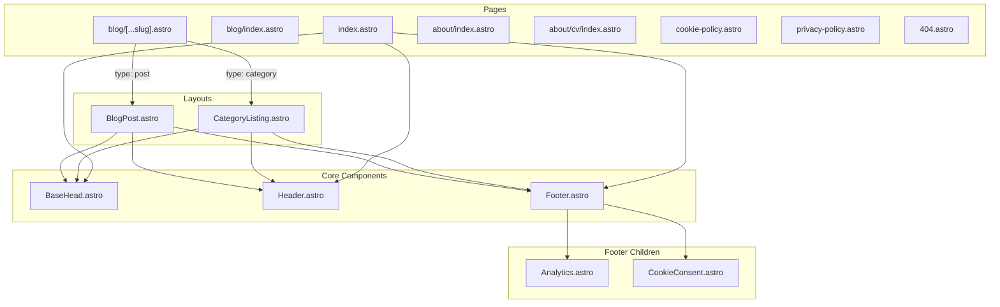
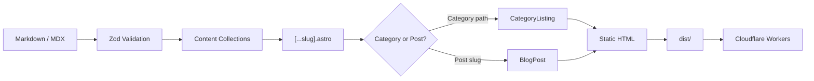
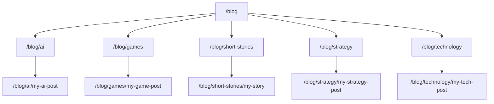
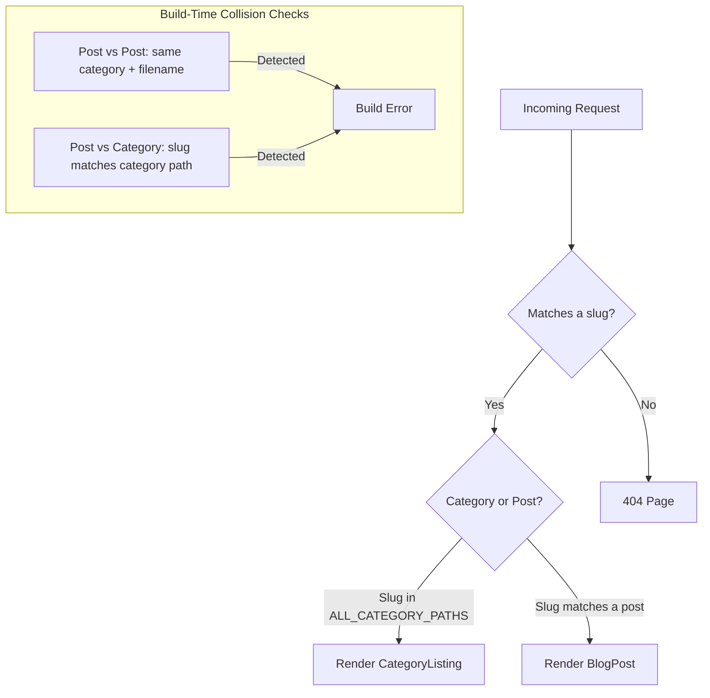

# alexmorcillo.com

Personal website and blog by Alex Morcillo — Exploring AI, games, architecture, and the ideas shaping our future. Built with Astro, styled with Tailwind CSS, deployed on Cloudflare.

[Live Site](https://alexmorcillo.com) · [RSS Feed](https://alexmorcillo.com/rss.xml)

---

## Tech Stack

| Technology | Version | Role |
|---|---|---|
| [Astro](https://astro.build) | v6 (beta) | Static site generation, zero JS shipped by default |
| [Tailwind CSS](https://tailwindcss.com) | v4 | CSS-first configuration with custom design tokens |
| [MDX](https://mdxjs.com) | - | Rich blog content with embedded components |
| [Svelte](https://svelte.dev) | v5 | Interactive components (charts, visualizations) |
| [Plausible Analytics](https://plausible.io) | - | Privacy-friendly, cookie-free analytics |
| [Cloudflare Workers](https://workers.cloudflare.com) | - | Edge deployment |
| [TypeScript](https://www.typescriptlang.org) | v5 | Strict mode throughout |

Supporting libraries: D3 (data visualization), Three.js (3D demos), Sharp (image optimization), rehype plugins (slug, autolink headings, external links, mermaid).

---

## Architecture Overview

### Component Relationships



### Content and Build Flow



### Category Hierarchy



Categories support up to 3 levels of nesting. Subcategories are defined in `CATEGORY_TREE` in `src/consts.ts` and all routing, breadcrumbs, and listing pages are auto-derived.

### Routing Decision Flow



---

## Design System

### Color Tokens

| Role | Light Mode | Dark Mode |
|---|---|---|
| Primary text | `ink` | `cream` |
| Secondary text | `ink-secondary` | `cream-secondary` |
| Muted text | `ink-muted` | `cream-muted` |
| Background | `canvas` (#FAFAF8) | `night` (#0C0C14) |
| Surface | `surface` | `night-surface` |
| Border | `border` | `night-border` |
| Accent | `accent` (#2acf62) | `accent` (#2acf62) |

### Typography

| Font | CSS Class | Usage |
|---|---|---|
| **Syne** | `font-display` | Headings, display text |
| **Newsreader** | `font-body` | Body text, prose content |
| **JetBrains Mono** | `font-mono` | Code, dates, metadata |

### Dark Mode

Class-based toggle on `<html>`. An anti-FOUC inline script in `BaseHead.astro` reads the `theme` key from `localStorage` before first paint, falling back to `prefers-color-scheme`. Every light color class is paired with a `dark:` variant.

---

## Features

- **Static site generation** — zero client-side JS shipped by default (Astro SSG)
- **Hierarchical categories** — up to 3 levels of nesting with auto-generated listing pages
- **Featured post system** — pin posts with `featuredTill` frontmatter date; falls back to newest post
- **Dark mode** — anti-FOUC script prevents flash, persists preference to localStorage
- **SEO** — Lighthouse 97-100 Performance, 100 SEO, 100 Best Practices
- **JSON-LD structured data** — WebSite, Person, BlogPosting, and BreadcrumbList schemas
- **Plausible analytics** — privacy-friendly, cookie-free tracking with custom events (scroll depth, theme toggle, social shares, navigation clicks)
- **RSS feed** — full-content feed at `/rss.xml` with per-post category tags
- **Sitemap** — auto-generated by `@astrojs/sitemap` at `/sitemap-index.xml`
- **Cookie consent** — floating banner with localStorage persistence, links to Cookie Policy and Privacy Policy
- **Social share buttons** — X, LinkedIn, Facebook, WhatsApp, Telegram with native share dialogs
- **Glass morphism effects** — frosted glass cards with shine sweep on hover, 3D perspective tilt
- **Responsive design** — mobile-first layout with sticky glass-effect header
- **Non-render-blocking fonts** — preload + media swap pattern for Google Fonts
- **Breadcrumbs** — navigational breadcrumbs with JSON-LD schema on all blog pages
- **Three.js demos** — interactive 3D examples at `/games/threejs/`
- **CV / About section** — dedicated pages with print-optimized CV layout

---

## Getting Started

Requires Node.js >= 22.12.0.

```bash
npm install        # Install dependencies
npm run dev        # Dev server at localhost:4321
npm run build      # Production build to ./dist/
npm run preview    # Preview production build
npx astro check    # TypeScript type checking
```

---

## Project Structure

```
src/
├── assets/          # Images, icons (Android/iOS), logos
├── components/      # 15 Astro + 1 Svelte component
│   ├── BaseHead.astro        # <head> content, meta tags, Plausible, fonts
│   ├── Header.astro          # Sticky glass-effect navigation
│   ├── Footer.astro          # Site footer, includes Analytics + CookieConsent
│   ├── Analytics.astro       # Plausible custom event tracking
│   ├── CookieConsent.astro   # Cookie consent banner
│   ├── Breadcrumbs.astro     # Navigation breadcrumbs with JSON-LD
│   ├── ShareSocial.astro     # Social share buttons
│   └── ...                   # FormattedDate, HeaderLink, Callout, etc.
├── content/blog/    # Blog posts organized by Category/Year/post.md
├── data/            # CV and structured data
├── demos/           # Three.js interactive demos
├── layouts/         # BlogPost.astro, CategoryListing.astro
├── pages/           # File-based routing (10 pages)
├── styles/          # global.css — Tailwind v4 config + design tokens
└── utils/           # posts.ts, categories.ts — URL generation, category tree
public/              # Static assets: favicons, robots.txt, web manifest
```

---

## Deployment

The site is deployed to [Cloudflare Workers](https://workers.cloudflare.com) via Wrangler. The production build outputs static HTML to `dist/`, which is served at the edge.

- **Production URL:** [https://alexmorcillo.com](https://alexmorcillo.com)
- **Build output:** `dist/`
- **Configuration:** `wrangler.toml` (Workers config), `astro.config.mjs` (Astro config)

---

## Performance

| Metric | Score |
|---|---|
| Lighthouse Performance | 97-100 |
| Lighthouse SEO | 100 |
| Lighthouse Best Practices | 100 |
| Total Blocking Time | 0 ms |
| Cumulative Layout Shift | ~0 |
| First Contentful Paint | ~0.8s |
| Client-side JS | 0 KB (default) |

---

## Links

- [alexmorcillo.com](https://alexmorcillo.com)
- [GitHub](https://github.com/morcillo-alex)
- [X / Twitter](https://x.com/alexmorcillo82)
- [LinkedIn](https://www.linkedin.com/in/alexmorcillo/)
