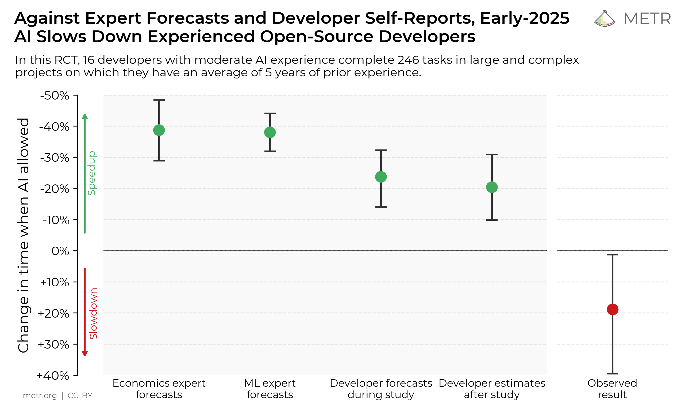

I am using extensively AI since a year now both, professionally and for my personal projects. I started interacting with the chat interfaces, copying and pasting code back and forth and, today, I am running multi-agent plans for large scaled refactors and architectural updates or complex features.

The amount of features that I am capable to release now has increased drastically. It is very hard to measure but you can feel that your speeds delivering value is way higher. What before would have taken me two weeks six months ago now is being delivered in a single day. The code is cleaner, the edge cases are covered, and I caught architectural issues before they hit production or spread further. **I'm genuinely moving faster**.

Then I read the [METR study](https://metr.org/blog/2025-07-10-early-2025-ai-experienced-os-dev-study/).

In July 2025, researchers ran a rigorous randomized controlled trial with 16 experienced open-source developers. The kind of engineers who maintain repositories with 22,000+ stars. They were given 246 real GitHub issues. Half got AI tools like Cursor Pro with Claude 3.5 Sonnet. Half worked without AI.

The result? **Developers with AI tools took 19% longer to complete tasks.**

The kicker: they believed they were 20% faster.

I'm either an outlier, delusional, or the studies are measuring the wrong thing. I think it's the third one, and understanding why matters if you're trying to figure out whether AI coding tools actually make you better or just make you feel better.

## The Gap Between Studies and Reality

Here's what makes the METR findings so unsettling. This wasn't a sloppy survey. The methodology was airtight:

- 16 experienced developers, not bootcamp graduates or hobbyists
- 246 real GitHub issues across bug fixes, features, and refactors
- Average task duration: two hours
- Compensation: $150/hour (enough to ensure serious effort)
- Randomized assignment to AI-allowed vs. AI-prohibited conditions

These developers expected AI would accelerate their work by 24%. After experiencing the slowdown, they still believed AI had sped them up by 20%. The perception gap is massive.

So what's happening?

The study doesn't say you shouldn't use AI. It says something more specific and more interesting: **experienced developers working in familiar codebases slow down when they add AI tools to their workflow.**

That qualifier matters. Because when I'm productive with AI, I'm rarely working in a familiar codebase on a well-understood problem. I'm prototyping something new, exploring an unfamiliar domain, or scaffolding architecture I'll refine later. The context is completely different.

## When AI Coding Tools Make You Slower

Let me be clear: AI absolutely can make you slower. I've watched it happen to myself and others. Here's when:

**When you're debugging your own recent code.** You already have the mental model. You know what you meant to do. Reading and verifying AI-generated fixes takes longer than just fixing it yourself. The cognitive overhead of explaining the problem to an AI, evaluating the proposed solution, and verifying it doesn't introduce new issues often exceeds the cost of just patching the bug.

**When you're working in a well-understood domain with established patterns.** If you've written authentication middleware five times before, the sixth time is mechanical. You don't need AI to generate it. You need your fingers to type what your brain already knows. Adding an AI intermediary just adds latency.

**When the AI generates plausible but subtly wrong code.** This is the killer. The model produces something that looks right, passes basic tests, and will absolutely fail in production under edge cases you didn't think to specify. Catching these requires intense scrutiny. You're not just reading code. You're reading code while constantly asking "what did the model misunderstand about my intent?"

The METR study likely captured all three scenarios. Experienced developers working in familiar repos on typical maintenance issues probably don't benefit from AI. They benefit from expertise and muscle memory.

**When supervision cost exceeds production cost.** Here's the thing nobody warns you about: AI generates code faster than you can properly review it. If you're running multiple AI agents concurrently, the cognitive load of maintaining quality across parallel workstreams is genuinely draining. I wrote about this in depth in ["AI Is Not a Tool. It Is Work."](/blog/ai/ai-cognitive-load/) Your System 2 (deliberate, analytical thinking) fatigues. Your System 1 (fast, intuitive pattern-matching) takes over. System 1 is terrible at catching confident-sounding errors. Quality erodes quietly.

## When AI Coding Tools Make You Faster

But here's where my experience diverges from the study results. When I'm faster with AI, it's in fundamentally different scenarios:

**When I'm exploring unfamiliar territory.** I wanted to add structured logging to a Python service but hadn't used `structlog` before. Claude generated a complete integration, explained the tradeoffs between different formatters, and showed me how to configure context injection. I refined it, tested it, shipped it. That would have been a full afternoon of reading docs and trial-and-error. It took 30 minutes.

**When I'm scaffolding architecture.** The initial structure of a new service (project setup, dependency injection, config management, error handling, testing infrastructure) is tedious but essential. AI can generate the entire scaffold while I focus on the domain-specific logic that actually matters. The generated code isn't perfect. It's a starting point that saves me two hours of boilerplate.

**When I'm working across language or framework boundaries.** I needed to integrate a Rust library into a Node.js project via FFI. I've done FFI exactly twice in my career. Claude walked me through the build config, showed me how to handle memory management across the boundary, and generated the TypeScript bindings. I reviewed, tested, adjusted. It worked. Without AI, I'd have been reading docs for hours before writing a single line.

**When I need to cover edge cases I'd otherwise miss.** Good AI models are paranoid. They think about null cases, timezone edge cases, encoding issues, race conditions. When I ask Claude to review a function, it flags things I didn't think to test. The signal-to-noise ratio isn't perfect, but I've caught real bugs this way before they hit production.

**When I'm translating between domains.** Converting a SQL query into equivalent Pandas operations. Translating a shell script into a cross-platform Python equivalent. Refactoring imperative code into functional style. These are mechanical transformations that are tedious and error-prone for humans. AI does them instantly and reliably if you verify the output.

The pattern here? I'm faster when I'm operating outside my comfort zone, when the task is exploratory or mechanical, and when my role shifts from producer to director.

## The Firefox Example: When AI Gets It Right

Here's proof that AI can be extremely capable when used correctly: In early 2026, Anthropic partnered with Mozilla to apply Claude to Firefox security analysis. The system found over 100 bugs, including 14 classified as high-severity.

Let me put that in context. Firefox is a mature codebase with millions of lines of C++ and Rust, maintained by some of the best engineers in open source, with continuous security audits. And an AI model found 14 high-severity bugs they'd missed.

This isn't vibe coding. This is systematic, exhaustive analysis of the kind humans struggle to sustain. The AI didn't get fatigued. It didn't get bored reviewing the same patterns across thousands of files. It flagged every instance of a potential vulnerability class and let human experts verify and prioritize.

That's the frontier. Not replacing developers. Augmenting the kind of exhaustive, tedious analysis that humans know they should do but realistically can't sustain at scale.

## Why The Studies Miss The Point

The METR study measured task completion time in familiar codebases. That's valid. It's also narrow.

What the study didn't measure:

- **Exploration bandwidth.** How many new technologies or frameworks did developers feel comfortable trying because AI lowered the learning curve?
- **Error prevention.** How many bugs were caught during development that would have shipped without AI review?
- **Cognitive offload.** How much mental energy was freed up by offloading mechanical tasks, allowing developers to focus on architecture and domain logic?
- **Capability expansion.** How many tasks did developers tackle that they wouldn't have attempted without AI support?

I'm not arguing the study is wrong. I'm arguing it's measuring the wrong thing if you want to understand whether AI tools make developers more effective.

Faster task completion on known problems isn't the game. The game is: can you solve harder problems, explore more options, catch more errors, and ship higher-quality systems than you could before?

For me, the answer is yes. But only because I've learned when to use AI and when to ignore it.

## The Skill Nobody Teaches: Knowing When to Use AI

Here's the uncomfortable truth: most developers are using AI wrong. They're using it the way they were taught to use Stack Overflow: when stuck, paste in the problem, accept the answer, move on.

That works for Stack Overflow because the answers have been upvoted by thousands of people and tested in production for years. It doesn't work for AI because the answer is generated on the spot, may be subtly wrong, and has zero validation beyond your own review.

The skill that separates productive AI users from those who slow down is knowing when the tool's strengths align with the task's demands.

**Use AI when:**
- You're in unfamiliar territory and need to bootstrap understanding quickly
- The task is mechanical and tedious (boilerplate, format conversions, repetitive refactoring)
- You want exhaustive coverage of edge cases and error conditions
- You're prototyping and iteration speed matters more than perfection

**Don't use AI when:**
- You already have a clear mental model and muscle memory for the task
- The code requires deep domain knowledge the AI doesn't have
- Verification cost will exceed writing it yourself
- The stakes are high and the margin for error is zero (security-critical code, financial transactions, healthcare logic)

**And critically: always verify.** Treat AI output like code from a junior developer who's brilliant but unreliable. Review every line. Test edge cases. Ask "what did the model probably get wrong?"

## The Real Productivity Gain Isn't Speed

Here's what I've realized after a year of serious AI-assisted development: the productivity gain isn't that I ship individual features faster. It's that I ship better features, explore more options, and catch more mistakes before they become incidents.

Last month, I was building a data sync service. My first design was event-driven with a message queue. Before writing code, I asked Claude to critique the architecture. It pointed out a race condition in my proposed design where overlapping updates could corrupt state. I would have caught that in testing, maybe. Or I would have shipped it and been paged at 2am. Instead, I redesigned before writing a line.

That's the real value. Not typing faster. Thinking better.

AI coding tools are not making me faster at the tasks I was already good at. They're expanding the surface area of problems I can tackle and the quality bar I can sustain. That's a fundamentally different kind of productivity.

## What Separates Fast Developers From Slow Ones

The METR study found a 19% slowdown on average. But averages hide distribution. I'd bet money there's a bimodal distribution in that data: some developers got dramatically slower, others got faster, and the average came out negative.

The difference isn't typing speed or years of experience. It's whether you've developed the meta-skill of AI-assisted development:

**Know your tools' failure modes.** Claude hallucinates API methods that don't exist. Copilot completes patterns it's seen before even if they're wrong for your context. GPT-4 generates confidently wrong explanations. Learn where your model tends to fail and look harder in those spots.

**Develop review discipline.** Your System 2 will fatigue after an hour of reviewing AI output. Take breaks. Don't approve code when you're tired. Set a quality bar and enforce it ruthlessly.

**Treat AI as a collaborator, not an oracle.** When Claude suggests something, my first question is "why?" If I can't explain why the solution works, I don't ship it. Understanding is non-negotiable.

**Maintain deep-production habits.** Write some code yourself. Debug without AI. Keep your core skills sharp. The day your AI tool goes down, you still need to ship.

The developers who get slower with AI are the ones using it as a replacement for thinking. The ones who get faster are using it as a thinking aid.

## The Question You Should Actually Ask

The METR study asks: "Do AI tools make developers faster at completing tasks?"

The better question is: "Do AI tools make developers more effective at building reliable software?"

Effectiveness includes speed, but also correctness, maintainability, edge case coverage, architectural soundness, and ability to work outside your comfort zone.

By that measure? Yes. Absolutely yes.

But only if you've learned to use the tools as tools, not as magic wands. Only if you've developed the discipline to review rigorously, the judgment to know when to engage AI and when to ignore it, and the self-awareness to recognize when you're rubber-stamping instead of reviewing.

The studies will catch up. Right now, they're measuring task completion time on familiar problems. Eventually, they'll measure what matters: whether AI-assisted developers build better systems, catch more bugs, explore more solutions, and ship more value.

Until then, I'll keep using the tools that make me better and ignoring the ones that don't.

And I'll keep shipping faster than the studies say I should be able to.

---

*Research for this article was conducted in March 2026. Key sources: [METR study on AI developer productivity](https://metr.org/blog/2025-07-10-early-2025-ai-experienced-os-dev-study/) (July 2025), Anthropic's partnership with Mozilla on Firefox security analysis (March 2026), and my own lived experience building software with Claude Code, Cursor, and GitHub Copilot over the past year.*
